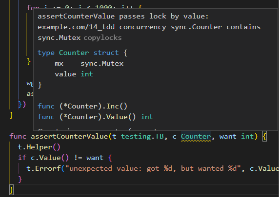

# Concurrency in Go using TDD: Sync
> this example illustrates how to use the sync package for concurrency

In this exercise we want to make a counter that is safe to use concurrently.

Using the TDD approach, we'll be begin with an unsafe implementation, and proceed to make it more robust as we go along.

## v0: single threadedd implementation

We're given total freedom with respect to the implementation and API. Therefore, we'll start simple by defining the counter as a struct that can be initialize using the composite literal syntax, and that features a method `Inc` to increment the counter value, and a method `Value` to get the current value of the counter.

## v1: testing our initial implementation under concurrency

Now that we have a single-threaded working version, we can proceed to test it under concurrency, and we will make use of the `sync` package for that.

We'll start by refactoring our tests to use subtests, so that we can test the concurrent scenarios in the same test function.

Then, we will implement the concurrent test as follows:

1. Define the counter

2. Define a `sync.WaitGroup`, a construct that will wait for a collection of goroutines to finish.

3. Use `WaitGroup.Add` to specify the number of goroutines to wait for, and make it 1000.

4. Write a loop that spawns 1000 goroutines that increment the counter. Note that to properly notify the wait group, you'll need to invoke `Done` right after the increment is done.

5. After having completed the spawning (which will be non-blocking), you'll have to call `Wait` to *wait* for the 1000 goroutines to complete.

6. Assert that the expected value is 1000.

You should confirm that our counter is not concurrent-safe, and therefore a new implementation should be given.

HINT: even if it works, run the test with `go test -race` to check if there's a race condition.

## v2: A concurrent-safe implementation using a mutex

One way to enable our simple counter as thread-safe is to use a mutex.

A mutex ensures that only a single goroutine is accessing the code that goes between a `mutex.Lock()` and `mutex.Unlock()`, thus ensure serialization.

In this version, we introduce a *mutex* in our counter to ensure that only a single goroutine is accessing the piece of code that increments our counter.

## v3: vetting our implementation

While our new implementation no longer features race conditions and works perfectly well, when we run `go vet` we get an error. This command analyzes your code and try to identify certain things that can make it fail:

```bash
$ go vet
# example.com/14_tdd-concurrency-sync
./safecnt_test.go:16:25: call of assertCounterValue copies lock value: example.com/14_tdd-concurrency-sync.Counter contains sync.Mutex
./safecnt_test.go:34:25: call of assertCounterValue copies lock value: example.com/14_tdd-concurrency-sync.Counter contains sync.Mutex
./safecnt_test.go:38:41: assertCounterValue passes lock by value: example.com/14_tdd-concurrency-sync.Counter contains sync.Mutex
```

Those errors come from the fact that we're making copies of a mutex, something that the documentation clearly states we shouldn't do.

Note also that your IDE will also warn you:



One simple solution is passing a pointer to the counter to `assertCounterValue` instead of making a copy. For proper refactoring, besides passing a counter to `assertCounterValue` you can create a constructor `NewCounter` that returns a pointer and use it in your tests.
