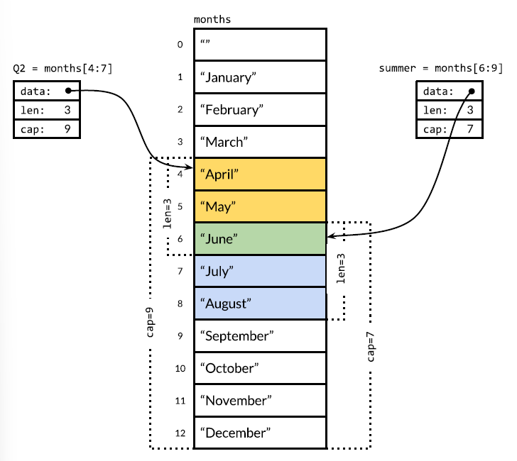

# lencap
> practicing len and capacity in slices

A slice has three components:
+ a pointer, that typically points to the first element of the underlying array
+ a length, that produces the number of elements in the slice
+ a capacity, that typically returns the number of elements from the first element of the slice, to the last element of the underlying array.

