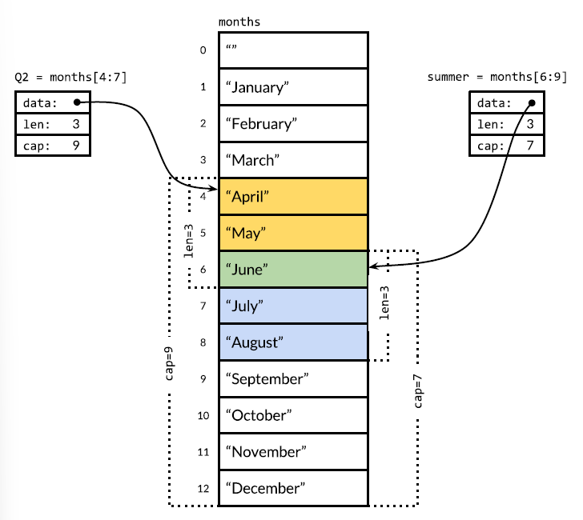

# 04 &mdash; Composite Types

## Intro

This sections discusses composite types: arrays, slices, maps, and structs.

Arrays and structs are *aggregate types*; their values are concatenations of other values in memory. Arrays are homogeneous &mdash; all their elements have the same type &mdash whereas structs are heterogeneous.

Both arrays and structs are fixed in size. In contrast, slices and maps are dynamic data structures that grow as values are added.

## Arrays

An array is a fixed-length sequence of zero or more elements of a particular type.

Because of their fixed length, arrays are rarely used directly in Go. By contrast, Slices, which can grow and shrink, are much more versatile, but to understand slices you must understand arrays first.

The following snippet illustrates the subscript notation to access element from zero to one less than the array length, the built-in `len` function and how to iterate over the elements:

```go
var a [3]int  // array of 3 ints
a[0]          // first elem
a[len(a)-1]   // last elem

for i, v := range a {
  fmt.printf("%d %d\n", i, v)
}

for _, v := range a {
  fmt.printf("%d\n", v)
}
```

Array elements are initialized to the zero value of their elements.

The *array literal* expression lets you initialize an array with a list of values:

```go
var q [3]int = [3]int{1, 2, 3}
var r [3]int = [3]int{1, 2}
fmt.Println(r[2])               // 0
```

You can use an ellipsis `...` to establish the length of an array as the number of the values you are passing while initializing it:

```go
q := [...]int{1, 2, 3}
fmt.Printf("%T\n", q)   // [3]int
```

The length of an array is part of its type, and its computed at compile time.

Although less common, it is possible to initialize an array specifying a list of index and value pairs:

```go
a := [...]string{1: "$", 2: "€", 0: "£", 3: "¥"}
fmt.Println(a)  // [£ $ € ¥]
```

As the indices can appear in any order, and some may be omitted (taking the zero value), the following expression initializes an array of 100 elements whose last element is `-1`:

```go
r := [...]int{99: -1}
```

| EXAMPLE: |
| :------- |
| See [01_arrays-initializing-arrays](01_arrays-initializing-arrays/README.md) for a runnable example. |

If an array's element type is *comparable*, then the array type is comparable too. This means we can directly compare two arrays using the `==` operator which reports whether all corresponding elements are equal:

```go
a := [2]int{1, 2}
b := [...]int{1, 2}
c := [2]int{1, 3}

fmt.Println(a == b, a == c, b == c) // true false false

d := [3]int{1, 2}
fmt.Println(a == d) // compile error: cannot compare
```

| EXAMPLE: |
| :------- |
| See [02_arrays-sha256](02_arrays-sha256/README.md) for a runnable example illustrating how to compare a SHA256 hash of a value. |

When a function is called, a copy of each argument value is assigned to the corresponding parameter variable, so the function receives a copy, not the original.

This make passing large arrays to functions very inefficient, as well as preventing the function from mutating the passed array.

| NOTE: |
| :---- |
| In this regard, Go treats arrays like any other basic type, but this is different from many other languages that implicitly pass arrays by reference. |

This can be avoided by passing a pointer to an array:

```go
func zero(ptr *[32]byte) {
  for i := range ptr {
    ptr[i] = 0
  }
}
```

Note that the previous function can be implemented very succinctly using:

```go
func zero(ptr *[32]byte) {
  *ptr = [32]byte{}
}
```

## Slices

Slices represent variable-length sequences whose elements all have the same type.

A slice type looks like an array type, but without a size:

```go
[]T // A slice of elements of type T
```

A slice is a lightweight data structure that gives access to a subsequence (or perhaps all) of the elements of an array, which is known as the slice's underlying array.

A slice has three components:

+ a pointer &mdash; points to the first element of the array that is reachable through the slice, which isn't necessarily the array's first element.

+ a length &mdash; the number of slice elements, which can't exceed the slice capacity.

+ a capacity &mdash; usually the number of elements between the start of the slice and the end of the underlying array.

The functions `len(s)` and `cap(s)` return those values.

Multiple slices can share the same underlying array and may refer to overlapping parts of that array.

Consider the following picture, in which we have an array of strings for the months of the year, and two overlapping slices of it.



The array is declared as:

```go
months := [...]string{1: "January", 2: "February", /* ... */ 12: "December"}
```

so that January is `months[1]` and December is `months[12]`.

The slice operator `s[i:j]` where 0 ≤ i ≤ j ≤ `cap(s)` creates a new slice that refers to the elements `i` through `j-1` of the sequence `s`, which may be an array variable, a pointer to an array, or another slice.

The resulting slice has `j-i` elements.

If `i` is omitted it's 0. If `j` is omitted it's `len(s)`.

As a result, the slice `months[1:13]` refers to the whole range of valid months, as does the slice `months[1:]`.

The slice `months[:]` refers to the whole array.

In the picture we defined `months[4:7]` for the 2nd quarter of the year, and `months[6:9]` for the norther hemisphere summer months.

```go
Q2 := months[4:7]
summer := months[6:9]
```

June is included in both:

```go
for _, s := range summer {
  for _, q := range Q2 {
    if s == q {
      fmt.Printf("%s appears in both slices\n", s)
    }
  }
}
```

Slicing beyond `cap(s)` produces a panic, but slicing beyond `len(s)` extends the slice so that the result may be longer than the original:

```go
fmt.Println(summer[:20])  // panic: slicing beyond cap(summer)!

endlessSummer := summer[:5] // extend slice beyond len within capacity
fmt.Println(endlessSummer) // ["June", "July", "August", "September", "October"]
```

| NOTE: |
| :---- |
| Note the similarity of the substring operation on strings to the slice operator in `[]byte` (byte slices). <br>The expression `x[m:n]` yields a string if `x` is a string, or a `[]byte` if `x` is a `[]byte`. |

Since a slice contains a pointer to an element of an array, passing a slice to a function permits the function to modify the underlying array elements. In other words, copying a slice create an *alias* and not a copy for the underlying array.

That's why the next function can be use to reverse the elements of an `[]int` in place:

```go
func reverse(s []int) {
	for i, j := 0, len(s) - 1; i < j; i, j = i + 1, j - 1 {
		s[i], s[j] = s[j], s[i]
	}
}
```

| EXAMPLE: |
| :------- |
| See [03_slices-reverse](03_slices-reverse/README.md) for a runnable example. |

When initializing a slice using something like `s := []int{1, 2, 3}`, an array variable of the right size is implicitly created and a slice pointing to it is yielded.

As with array literals, slice literals may specify the values in order, or give their indices explicitly, or use a mix of the two styles.

Unlike arrays, slices are not comparable, so we cannot use `==` to test if two slices contain the same elements. As a result you will be forced to use `slices.Equal` or implement the function yourself.

```go
func equal(x, y []int) bool {
	if len(x) != len(y) {
		return false
	}

	for i := range x {
		if x[i] != y[i] {
			return false
		}
	}
	return true
}
```

| EXAMPLE: |
| :------- |
| See [04_slices-equal](04_slices-equal/README.md) for a runnable example. |

The only legal slice comparison is against `nil`:

```go
if summer == nil {
  /* this comparison is allowed */
}
```

The zero value of a slice type is `nil`. A nil slice has no underlying array. It has length and capacity zero.

Note that there might be non-nil slices with length and capacity zero, such as `[]int{}` or `make([]int, 3)[3:]`.

As with any type that can have `nil` values, the nil value of a particular slice type can be written using `[]int(nil)`.

Thus:
+ if you need to test if a slice is empty use `len(s) == 0`, not `s == nil`.
+ if you need to test if a slice is nil use `s == nil`.

```go
var s []int     // len = 0, s == nil: true
s = nil         // len = 0, s == nil: true
s = []int(nil)  // len = 0, s == nil: true
s = []int{}     // len = 0, s == nil: false
```

The built-in function `make` creates a slice of a specified element type, length, and capacity. The capacity may be omitted, in which case, the capacity equals the length:

```go
make([]T, len)
make([]T, len, cap)   // same as make([]T, cap)[:len]
```

### The `append` function

The built-in `append` function appends items to slices:

```go
var runes []rune
for _, r := range "Hello, 𢉩" {
  runes = append(runes, r)
}
fmt.Println("%q\n", runes) // ['H' 'e' 'l' 'l' 'o' ',' ' ' '𢉩']
```

The `append` function is crucial to understanding how slices work.

Here's a custom implementation `appendInt` that resembles what the built-in function does:

```go
func appendInt(x []int, y int) []int {
	var z []int
	zlen := len(x) + 1
	if zlen <= cap(x) {
		z = x[:zlen]
	} else {
		// Not enough space, allocate a new array doubling current len
		// if desired capacity is below the double of current len
		zcap := zlen
		if zcap < 2*len(x) {
			zcap = 2 * len(x)
		}
		z = make([]int, zlen, zcap)
		copy(z, x)	// built-in function that copies elements from one slice to another
	}
	z[len(x)] = y
	return z
}
```

Remember that a slice is nothing more than:
+ a pointer
+ a length which is the number of slice elements
+ a capacity which is the number of elements between the first element of the slice and the end element of the underlying array.

As such, `appendInt` first checks if there's space in the underlying array to hold one more element, which means checking if the *projected length* is less or equal to the capacity. If so, it extends the slice by defining a larger slice (still withing the original array), copies the element into the last position and returns the new slice. In this case, the new slice is still using the same underlying array `x` was using.

If there's not sufficient space, `appendInt` allocates a new slice using `make`, copy the values from the original to the new one using `copy` to finally copy the new element in the correct position and returns the array.

Note that you might be tempted to write the following instead of copy:

```go
z = make([]int, zlen, zcap)
z = x // this just copies the address of x into z, not its contents
```

But that just makes z point to x. Remember that a slice is a pointer to an underlying array.

Conversely, we could have used a loop instead of `copy` but copy is much more efficient and succinct.

Consider the following scenario, in which:

```go
a := [...]int{0, 1, 2, -1}
x := a[:3]
fmt.Printf("%v\tlen=%d\tcap=%d", x, len(x), cap(x)) // [0 1 2] len=3 cap=4
```

Let's now assume that we do:

```go
y := appendInt(x, 3)
```


The slice has capacity 4, so there's a single element of slack and `appendInt` can proceed to add the element to the underlying array without reallocating. Now the slice has a length and capacity of 4.

However, if we do now:

```go
x = y
y = appendInt(x, 4)
```

There is no slack at all, and `appendInt` will have allocate a new array. The newly desired length will be 5, and the following computation is performed:

```go
zcap := zlen // zlen is the new len, that is 5
if zcap < 2*len(x) {    // 5 < 2*4
  zcap = 2 * len(x)     // zcap = 8
}
x = make([]int, zlen, zcap)
```

As 5 is less than 2 * 4 = 8, a new slice with capacity 8 will be allocated.

| NOTE: |
| :---- |
| The actual growth strategy for `append` might be more sophisticated than this one. |

It is quite common to do:

```go
runes = append(runes, r)
```

Again, it's important to bear in mind that although the elements of the underlying array are indirect, the slice's pointer, length, and capacity are not. That is, a slice is something like:

```go
type IntSlice struct {
  ptr       *int
  len, cap  int
}
```

Thus, updating the slice variable is required not only when calling `append`, but always that we call any function that may change the length or capacity of a slice, or when the function makes it refer to a different underlying array.

The built-in `append` function lets you add more than one new element, or even a whole slice of them using the ellipsis `...`.

```go
var x []int
x = append(x, 1)
x = append(x, 2, 3)
x = append(x, 4, 5, 6)
x = append(x, x...)     // append the slice x
fmt.Println(x)          // [1 2 3 4 5 6 1 2 3 4 5 6]
```

This requires the function to become *variadic*, that is, to accept any number of final arguments:

```go
func appendInt(x []int, y ...int) []int {
	var z []int
	zlen := len(x) + len(y)
	if zlen <= cap(x) {
		z = x[:zlen]
	} else {
		// Not enough space, allocate a new array doubling current len
		// if desired capacity is below the double of current len
		zcap := zlen
		if zcap < 2*len(x) {
			zcap = 2 * len(x)
		}
		z = make([]int, zlen, zcap)
		copy(z, x)	// built-in function that copies elements from one slice to another
	}
	copy(z[len(x):], y)
	return z
}
```

When defining the function you use the `...` to declare the final argument, and when invoking the function with a slice you use the `...` to prefix its invocation.

```go
func appendInt(x []int, y ...int) []int { /*... */ }
x = append(x, 4, 5, 6)  // multiple args
x = append(x, x...)     // single slice
```

| EXAMPLE: |
| :------- |
| See [06_slices-append-ints](06_slices-append-ints/README.md) for a runnable example. |

### In-place Slice Techniques

Consider the following function that given a list of strings, returns the non-empty ones:

```go
func nonEmpty(strings []string) []string {
	i := 0
	for _, s := range strings {
		if s != "" {
			strings[i] = s
			i++
		}
	}
	return strings[:i]
}
```

Because we're using an in-place, and a slice maintains a pointer to an underlying array, when we're executing that function we're actually modifying the underlying array elements:

```go
data := []string{"one", "", "three"}
	fmt.Printf("%q\n", data)						// ["one" "" "three"]
	fmt.Printf("%q\n", nonEmpty(data)) 	// ["one" "three"]
	fmt.Printf("%q\n", data) 						// ["one" "three" "three"]
```

When using this method we're not allocating a new array, but it might not be exactly what we wanted.

We can have an alternative implementation using `append`:

```go
func nonEmpty(strings []string) []string {
	out := strings[:0]	// zero-length string of the original
	for _, s := range strings {
		if s != "" {
			out = append(out, s)
		}
	}
	return out
}
```

And this also produce the same result.

| EXAMPLE: |
| :------- |
| See [07_slices-non-empty-strings](07_slices-non-empty-strings/README.md) for a runnable example.<br>An additional example of a stack implemented with a slice is found in [08_slices-stack](08_slices-stack/README.md). |


## Maps

Maps are hash tables &mdash; an unordered collection of key/value pairs in which all the keys are distinct, and the value associated with a given key can be retrieved, updated, or removed using a constant number of key comparisons on the average, no matter how large the hash table.

In Go terms, a map is a reference to a hash table, and a map type is written `map[K]V` where `K` is the type of the keys and `V` the types of the values.

The key type must be comparable using `==`, and there are no restrictions on the value type `V`.

You can create a map using `make`:

```go
ages := make(map[string]int)
```

And we can create a map literal:

```go
ages := map[string]int{
	"alice": 31,
	"charlie": 34,
}
```

which is equivalent to:

```go
ages := make(map[string]int)
ages["alice"] = 31
ages["charlie"] = 34
```

A new empty map can also be created using:

```go
ages := map[string]int{}
```

We've seen that map elements can be accessed using the syntax:

```go
ages["alice"] = 32					// Write
fmt.Println(ages["alice"]) 	// Read
```

A map element can be removed using the `delete` built-in function:

```go
delete(ages, "alice")	// Delete
```

All these operations are safe even if the element isn't in the map:

+ a map lookup for a key that isn't present returns the zero value for its type.

As a result you can do:

```go
ages["bob"]++
```

even if `ages["bob"]` is not present in the map.

A map element is not a variable and therefore you cannot take its address:

```go
err = &ages["bob"]	// Compile err
```

You can enumerate all the key/value pairs using range:

```go
for name, age := range ages {
	fmt.Println("%s\t%d\n", name, age)
}
```

Map elements might be *rehashed* as the map grows. As a result, you should consider that the order of elements in a map is random.

It is a common pattern to use a sort mechanism when you need to get the key/value pairs in order.

```go
import "sort"

// ...

var names []string
for name := range ages {
	names = append(names, name)
}
sort.Strings(names)
for _, name := range names {
	fmt.Printf("%s\t%d\n", name, ages[name])
}
```

The zero value for a map is `nil` (meaning the map is not referencing any hash table at all).

Storing to a nil map causes a panic &mdash; a map must be allocated before you can store into it:

```go
var ages map[string]int			// nil map
fmt.Println(ages == nil) 		// true
fmt.Println(len(ages) == 0) // true
ages["carol"] = 21 					// panic
```

You can obtain the number of elements of a map with `len`:

```go
fmt.Println(len(ages))
```

While doing `ages["carol"]` when `"carol"` is not on the map is safe and won't panic, sometimes you need to know if an element is present on the list or not:

```go
age, ok := ages["bob"]
if !ok {
	// ... bob not in the map ...
}
```

Many times you'll find the following syntax:

```go
if age, ok := ages["bob"]; !ok {
	// ... bob not in the map ...
}
```

As with slices, maps cannot be compared with each other, and the only valid comparison is with `nil`.

Therefore, to compare if two maps are equals you need to write a loop:

```go
func equal(x, y map[string]int) bool {
	if len(x) != len(y) {
		return false
	}
	for k, xv := range x {
		if yv, ok := y[k]; !ok || xv != yv {
			return false
		}
	}
	return true
}
```

| EXAMPLE: |
| :------- |
| See [10_map-equal](10_map-equal/README.md) for a runnable example. |


| NOTE: |
| :---- |
| You can also use `maps.Equal`. |


Go does not provide a `set` type, but since the keys of a map are distinct, a map can be used to serve this purpose.


| EXAMPLE: |
| :------- |
| See [11_maps-map-as-set](11_maps-map-as-set/README.md) for a runnable example. |

Sometimes we need a map or set whose keys are slices, but because map's keys must be comparable using `==`, this cannot be done directly.

However, you can define a helper function `k` that maps each key to a string so that `k(x) == k(y)` if `x` and `y` are equivalent.

The following example uses this approach for a map of string slices:

```go
var m = make(map[string]int)

func k(list []string) string {
	return fmt.Sprintf("%q", list)
}

func Add(list []string) {
	m[k(list)]++
}

func Count(list []string) int {
	return m[k(list)]
}
```

Note that this approach can also be used for any non-comparable key type and not just slices.

| EXAMPLE: |
| :------- |
| See [12_maps-char-count](12_maps-char-count/README.md) for additional examples with maps. |


The value type of a map can itself be a composite type, such as a map or slice.

In the following code, the key type of graph is `string` and the value is `map[string]bool` representing a set of strings. That is, `graph` maps a string to a set of related strings, which are the successors in a directed graph.

```go
var graph = make(map[string]map[string]bool)

func addEdge(from, to string) {
	edges := graph[from]
	if edges == nil {
		edges = make(map[string]bool) // set up value of the map
		graph[from] = edges
	}
	edges[to] = true
}

func hasEdge(from, to string) bool {
	return graph[from][to]
}
```

Note how the value of the map is initialized lazily, that is, only after its key appears for the first time.

Also, the `hasEdge` function relies on the zero value to give a meaningul result.

| EXAMPLE: |
| :------- |
| See [13_maps-graph-of-strings](13_maps-graph-of-strings/README.md) for a runnable example. |

## Structs

A *struct* is an aggregate data type that groups together zero or more named value of arbitrary types as a single entity.

Each value is called a field.

The following example illustrates an employee record modeled as a struct named `Employee`:

```go
type Employee struct {
	ID 				int
	Name 			string
	Address 	string
	DoB 			time.Time
	Position 	string
	Salary 		int
	ManagerID int
}

var employee Employee
```

The individual fields are accessed using dot notation like `employee.Name`.

The fields of a struct are variables too, and you can assign them to a field or take their addresses:

```go
employee.Salary -= 5000
position = &employee.Position
*position = "Sr. " + *position
```

The dot notation is also valid for pointers.

```go
var employeeOfTheMonth *Employee = &employee
employeeOfTheMonth.Position += "(rockstar and unicorn)"
```

The following function returns a pointer to an `Employee` struct:

```go
func EmployeeByID(id int) *Employee { /* ... */ }

fmt.Println(EmployeeByID(employee).Position)

id = employee.ID
EmployeeByID(id).Salary = 0
```

Note that if `EmployeeByID` would return `Employee` instead of a pointer to Employee the previous statement would not compile:

```go
func EmployeeByID(id int) Employee { /* ... */ }

EmployeeByID(1).Salary = 0 // Compiler Error: left-hand side does not identify a variable
```

| EXAMPLE: |
| :------- |
| See [14_struct-employee](14_struct-employee/README.md) for a runnable example. |

The name of a struct will be exported if it begins with a capital letter, and a struct can contain a mixture of exported and unexported fields.

A named struct type `S` can't declare a field of the same type `S`. But `S` may declare a field of type `*S` which let us create recursive data structures.

The following snippet illustrate such an approach which features a binary tree to implement an insertion sort.

```go
type tree struct {
	value 			int
	left, right *tree
}

// Sort sort values in place.
func Sort(values []int) {
	var root *tree
	for _, v := range values {
		root = add(root, v)
	}
	appendValues(values[:0], root)
}

func appendValues(values []int, t *tree) []int {
	if t != nil {
		values = appendValues(values, t.left)
		values = append(values, t.value)
		values = appendValues(values, t.right)
	}
	return values
}

func add(t *tree, value int) *tree {
	if t == nil {
		t = new(tree)
		t.value = value
		return t
	}
	if value < t.value {
		t.left = add(t.left, value)
	} else {
		t.right = add(t.right, value)
	}
	return t
}
```

| EXAMPLE: |
| :------- |
| See [15_structs-recursive-structs](15_structs-recursive-structs/README.md) for a runnable example. |

The zero value for a struct is composed of the zero values of each of its fields.

The struct type with no fields is called the *empty struct*, written `struct{}`. It's common practice to use `struct{}` instead of `bool` as the value type of a map that represents a set, to emphasize that only the keys are significant, because `struct{}` has size 0. However, the space saving is marginal, so it's ok to use `bool` instead.

```go
seen := make(map[string]struct{}) // set of strings
```

### Struct literals

A value of a struct type can be written as a *struct literal*:

```go
type Point struct{ X, Y int }

// Specifying a value for every field, without using field names
p := Point{1, 2}

type T struct { a, b int }

// Listing some or all of the field names
var q = T{a: 1, b: 2}
var r = T{b: 3}
```

Struct values can be passed as arguments to functions and returned from them.

```go
func Scale(p Point, factor int) Point {
	return Point(p.X * factor, p.Y * factor)
}

fmt.Println(Scale(Point{1, 2}, 5)) // {5, 10}
```

For efficiency, larger struct types are usually passed to or returned from functions indirectly using a pointer:

```go
func Bonus(e *Employee, percent int) {
	return e.Salary * percent / 100
}
```

And because Go is a *call-by-value* language, you'll be required to use pointers if the function must modify its argument, as the function only received a copy of the argument otherwise.

```go
func AwardAnnualRaise(e *Employee) {
	e.Salary = e.Salary * 105 / 100
}
```

The following snippets are equivalent, but the first is far more common:

```go
pp := &Point{1, 2}

// Alternative, but exactly equivalent
pp := new(Point)	// Allocates a block of memory to hold a Point and return address
*pp = Point{1, 2} // Initializes the block with a Point{1, 2}
```

### Comparing Structs

If all the fields of a struct are comparable, the struct itself is comparable, and therefore you can use `==` and `!=`.

The `==` will compare the corresponding fields of the two structs in order.

```go
p := Point{1, 2}
q := Point{2, 1}

fmt.Println(p == q) // same as p.X == q.X && p.Y == q.Y
```

Comparable structs can be used as key type of a map:

```go
type address struct {
	hostname 	string
	port 			int
}

hits := make(map[address]int)
hits[address{["golang.org"], 443}]++
```

### Struct Embedding and Anonymous Fields

Go's unusual struct embedding mechanism lets you use one named struct type as an anonymous field of another struct type, providing a convenient syntactic shortcut, so that a simple dot expression such as `x.f` can stand for a chain of fields like `x.d.e.f`.

Consider a 2D drawing program that provides a library of shapes, such as rectangles, ellipses, stars, and wheels:

```go
type Circle struct {
	X, Y, Radius struct
}

type Wheel struct {
	X, Y, Radius, Spokes int
}
```

A `Wheel` has all the features of a `Circle`, plus `Spokes`, the number of inscribed radial spokes.

The following snippet illustrates how to create a `Wheel`:

```go
var w Wheel
x.X = 8
w.Y = 8
w.Radius = 5
w.Spokes = 20
```

As the library grows and we identify repeatable patterns, we might start factoring out their common parts:

```go
type Point struct {
	X, Y int
}

type Circle struct {
	Center Point
	Radius int
}

type Wheel struct {
	Circle Circle
	Spokes int
}
```

After doing so, accessing the fields of a wheel has become more verbose:

```go
var w Wheel
w.Circle.Center.X = 8
w.Circle.Center.Y = 8
w.Circle.Radius = 5
w.Spokes = 20
```

In order to solve this, Go lets you declare a field with a type an no name; such fields are called *anonymous fields*. The type must be a named type or a pointer to a named type:

```go
type Circle struct {
	Point
	Radius int
}

type Wheel struct {
	Circle
	Spokes int
}

var w Wheel
w.X = 8					// same as w.Circle.Point.X = 8
w.Y = 8					// same as w.Circle.Point.Y = 8
w.Radius = 5		// same as w.Circle.Radius = 5
w.Spokes = 20
```

Note that the code in comments is valid, showing the the term anonymous field is a bit of a misnomer &mdash; the fields have names but those are optional in dot expressions, thus simplifying the DX.

Unfortunately, there's no shorthand for the struct literal syntax:

```go
w = Wheel{8, 8, 5, 20} // compile err
w = Wheel{X: 8, Y: 8, Radius: 5, Spokes: 20} // compile err

w = Wheel{Circle{Point{8, 8}, 5}, 20} // OK
w = Wheel{
	Circle: Circle{
		Point: Point{X: 8, Y: 8},
		Radius: 5,
	},
	Spokes: 20,
} // OK
```

Because anonymous fields do have implicit names:
+ You cannot have two anonymous fields of the same type, as their names would conflict.
+ As the name is determined by its type, so too is the visibility of the field. If if the the examples above, `Point` and `Circle` has been unexported (`point` and `circle`), they'd been unexported too preventing us from accessing them outside of the package in which they're declared.

| NOTE: |
| :---- |
| Struct embedding makes the struct not only get the fields of the embedded struct, also the methods. This will let us get complex behaviors from simpler ones through composition. |

| EXAMPLE: |
| :------- |
| See [16_structs-embedding-anonymous-fields](16_structs-embedding-anonymous-fields/README.md) for a runnable example on struct embedding. |

## JSON

Go has excellent support for encoding and decoding JSON through the library package `encoding/json`.

| NOTE: |
| :---- |
| XML and Google's Protocol Buffers are also supported through a similar API in the packages `encoding/xml` and `encoding/asn1`. |

The basic JSON types are:
+ numbers (in decimal or scientific notation)
+ booleans (`true` or `false`)
+ strings (sequences of Unicode code points enclosed in double quotes, supporting `\Uhhhh` for numeric escapes in UTF-16)

These basic types can be combined recursively with arrays and objects to create more complex sequence of values.

Consider an application that gathers movie reviews and offers recommendations.

```go
type Movie struct {
	Title  string
	Year   int  `json:"released"`
	Color  bool `json:"color,omitempty"`
	Actors []string
}

var movies = []Movie{
	{Title: "Casablanca", Year: 1942, Color: false,
		Actors: []string{"Humphrey Bogart", "Ingrid Bergman"}},
	{Title: "Cool Hand Luke", Year: 1967, Color: true,
		Actors: []string{"Paul Newman"}},
	{Title: "Bullitt", Year: 1968, Color: true,
		Actors: []string{"Steve McQueen", "Jacqueline Bisset"}},
}
```

Data structures like this are good candidates for converting them from Go structures into JSON and back.

Converting a Go data structure like `movies` into JSON is called *marshaling* and it is performed through the `json.Marshal` function:

```go
import (
	"encoding/json"
	/* ... */
)

/* ... */
data, err := json.Marshal(movies)
if err != nil {
	log.Fatalf("JSON marshaling failed: %s", err)
}
fmt.Printf("%s\n", data) // [{"Title": "Casablanca","released":1942,"Actors":["Humphrey Bogart"...]}]
```

`json.Marshal` produces a byte slice containing the JSON representation of the Go structure, with no extraneous white space.

The variant `json.MarshalIndent` lets you get a prettier JSON representation of the same Go structure:

```go
	data, err = json.MarshalIndent(movies, "", "  ")
	if err != nil {
		log.Fatalf("JSON marshaling failed: %s", err)
	}
	fmt.Printf("%s\n", data)
```

Resulting in:

```
[
  {
    "Title": "Casablanca",
    "released": 1942,
    "Actors": [
      "Humphrey Bogart",
      "Ingrid Bergman"
    ]
  },
  {
    "Title": "Cool Hand Luke",
    "released": 1967,
    "color": true,
    "Actors": [
      "Paul Newman"
    ]
  },
  {
    "Title": "Bullitt",
    "released": 1968,
    "color": true,
    "Actors": [
      "Steve McQueen",
      "Jacqueline Bisset"
    ]
  }
]
```

Marshaling uses the Go struct field names as the field names for JSON objects through reflection, and only exported fields are marshaled.

You can customize these behaviors through *field tags*. A field tag is a string of metadata associated at compile time with the field of a struct:

```go
Year  int  `json:"released"`
Color bool `json:"color,omitempty"`
```

A field tag may be any literal string, but it is conventionally interpreted as a space-separated list of `key:"value"` pairs, and that's why they are typically written with raw string literals.

| NOTE: |
| :---- |
| No spaces are allowed between the field tag and the value. |

The `json:` key controls the behavior of the `encoding/json` package. The first part of the field tag lets you choose an alternative JSON name for the Go field. Additional properties such as `omitempty` can be used to indicate that no JSON output should be produced if the field has the zero value for its type (`false`)

The inverse operation to marshaling, decoding a JSON string and populating a Go data structure, is called *unmarshaling* and it's done by `json.Unmarshal`.

The following snippet unmarshals JSON movie data into a slice of structs.

```go
moviesFromJSON := []Movie{}
if err := json.Unmarshal(data, &moviesFromJSON); err != nil {
	log.Fatalf("JSON unmarshaling failed: %s", err)
}
```

When unmarshaling, you can define a Go data structure that is different from the JSON object to select which parts of the JSON input you'd want to decode and which to discard.

For example, we can create a struct featuring only the `Title` part of the JSON so that only those fields are decoded:

```go
var titles []struct{ Title string }
if err := json.Unmarshal(data, &titles); err != nil {
	log.Fatalf("JSON unmarshaling failed: %s", err)
}
fmt.Println(titles) // [{Casablanca} {Cool Hand Luke} {Bullit}]
```

| NOTE: |
| :---- |
| The matching process that associated JSON names with Go struct names during unmarshaling is case-insensitive. As a result, you can use capitalized field names to export certain fields even if the JSON names are not without requiring field tags. |

| EXAMPLE: |
| :------- |
| See [17_json-hello](17_json-hello/README.md) for a runnable example. |

Many web services provide a JSON interface that return a JSON document when you make an HTTP request.

To illustrate how to do that in Go, let's build a program that queries the Github issue tracker and returns a list of issues.

Let's start with the types definition:

```go
const IssuesURL = "https://api.github.com/search/issues"

type IssuesSearchResult struct {
	TotalCount int `json:"total_count"`
	Items      []*Issue
}

type Issue struct {
	Number    int
	HTMLURL   string `json:"html_url"`
	Title     string
	State     string
	User      *User
	CreatedAt time.Time `json:"created_at"`
	Body      string
}

type User struct {
	Login   string
	HTMLURL string `json:"html_url"`
}
```

Note that the names of all the struct fields are capitalized, even if their JSON names are not.

Note also that we're being selective about the fields that we want to decode (the Github API will return much more information).

Next we create the `SearchIssues` function that makes an HTTP request and decodes the result. `url.QueryEscape` is used to ensure that special characters are correctly escaped and encoded:

```go
func SearchIssues(terms []string) (*IssuesSearchResult, error) {
	q := url.QueryEscape(strings.Join(terms, " "))
	resp, err := http.Get(IssuesURL + "?q=" + q)
	if err != nil {
		return nil, err
	}

	// we could have used defer
	if resp.StatusCode != http.StatusOK {
		resp.Body.Close()
		return nil, fmt.Errorf("search query failed: %s", resp.Status)
	}

	var result IssuesSearchResult
	if err := json.NewDecoder(resp.Body).Decode(&result); err != nil {
		resp.Body.Close()
		return nil, err
	}
	resp.Body.Close()
	return &result, nil
}
```

The previous examples used `json.Unmarshal` to decode the entire contents of a byte slice. In this case, we use the JSON streaming decoder `json.Decoder` which allows several JSON entities to be decoded in sequence from the same stream.

| NOTE: |
| :---- |
| There's a corresponding streaming encoder called `json.Encoder`. |

The call to `Decode` populates `result` through a pointer.

With the result in hand, we can proceed to show its contents in a tabular format using some of the `Printf` niceties:

```go
result, err := SearchIssues(os.Args[1:])
if err != nil {
	log.Fatal(err)
}
fmt.Printf("%d issues:\n", result.TotalCount)
for _, item := range result.Items {
	fmt.Printf("#%-5d %9.9s %.55s\n", item.Number, item.User.Login, item.Title)
}
```

| EXAMPLE: |
| :------- |
| See [18_json-web](18_json-web/README.md) for a runnable example. |

## Text and HTML Templates

A template is a string or file containing one or more portions enclosed in double braces `{{...}}` called actions.

Most of the string is printed literally, but the actions trigger other behaviors. Each action contains an expression in the template language, a simple but powerful notation for printing values, selecting struct fields, calling functions and methods, expressing control flow such as if-else statements, range loops, and instantiating other templates.

The `text/template` and `html/template` packages provides mechanisms for substituting the values of variables into a text or HTML template.

A simple template will look like:

```go
const templ = `{{.TotalCount}} issues:
{{range .Items}}----------------------------------------
Number: {{.Number}}
User:   {{.User.Login}}
Title:  {{.Title | printf "%.64s"}}
Age:    {{.CreatedAt | daysAgo}} days
{{end}}
```

Within an action, theer is a notion of the current value, referred to as *"dot"* and written as `.`. This referes to the template's parameter, which in the previous case will be a `github.IssuesSearchResult` struct.

As a result, `{{.TotalCount}}` action expands to the value of the `TotalCount` field in that struct.

The `{{range .Items}}` and `{{end}}` create a loop, so the text between them is expanded multiple times, with do bound to successive elements of Items.

Within the action, the `|` notation makes the result of one operation, the argument of another, analogous to a Unix shell pipeline.

In `{{.Title | printf "%.64s"}}` we're sending the `Title` to `fmt.Sprintf`. For Age, we're doing sending the `CreatedAt` field to the `daysAgo` function, which converts the field into an elapsed time using `time.Since`:

```go
func daysAgo(t time.Time) int {
	return int(time.Since(t).Hours() / 24)
}
```

Notice that the `CreatedAt` was defined as:

```go
CreatedAt time.Time
```

In the same way that a type may control its string formatting, by defining certain methods, a type may also defined methods to control its JSON marshaling and unmarshaling behavior. The JSON-marshaled value of a `time.Time` is a string in a standard format.

Producing output with a template is a two-step process:
1. You must parse the template into a suitable internal representation.
2. You execute it on specific inputs.

```go
report, err := template.New("report").
	Funcs(template.FuncMap{"daysAgo": daysAgo}).
	Parse(templ)

if err != nil {
	log.Fatal(err)
}
```

| NOTE: |
| :---- |
| Template parsing needs to be done only once. |

Templates are usually fixed at compile time, and therefore, failing to parse a template is typically a fatal error in your program.

The `template.Must` helper function makes error handling more concise by panicking if the template fails to parse.

Finally, we can execute it using the result of `SearchIssues` invocation and and `os.Stdout` as the destination.

```go
var report = template.Must(template.New("issueList").
	Funcs(template.FuncMap{"daysAgo": daysAgo}).
	Parse(templ))

func main() {
	result, err := SearchIssues(os.Args[1:])
	if err != nil {
		log.Fatal(err)
	}
	if err := report.Execute(os.Stdout, result); err != nil {
		log.Fatal(err)
	}
}
```

In a similar way, we can build an HTML template. It uses the same API and expression language, but adds features for automatic and context-appropriate escaping of strings appearing within HTML, JavaScript, CSS, or URLs.

These features help mitigate the perennial security problem of HTML generation, an *injection attack*, in which an adversary crafts a string value like the title of an issue to include malicious code that when improperly escaped by a template, gives them control over the page.

That is, the `html/template` package automatically handles the escaping so that `<` is converted to `"&lt;"` so that text containing the character `<link>` does not become a hyperlink, and instead is transformed into `&lt;link&gt;` which could compromise the security.


The template itself is nothing complicated:

```go
var issueList = template.Must(template.New("issuelist").Parse(`
<h1>{{.TotalCount}} issues</h1>
<table>
  <tr style="text-align: left">
		<th>#</th>
		<th>State</th>
		<th>User</th>
		<th>Title</th>
	</tr>
	{{range .Items}}
	<tr>
		<td><a href="{{.HTMLURL}}">{{.Number}}</td>
		<td>{{.State}}</td>
		<td><a href="{{.User.HTMLURL}}">{{.User.Login}}</a></td>
		<td><a href="{{.HTMLURL}}">{{.Title}}</a></td>
	</tr>
	{{end}}
</table>
`))
```

It is possible to suppress this auto-escaping for fields that contain trusted HTML data using the named string type `template.HTML` instead of `string`. Similar types exist for trusted JavaScript, CSS, and URLs.

The example above illustrates this idea by using two fields with the same value but different types:

```go
func main() {
	const templ = `<p>A: {{.A}}</p><p>B: {{.B}}</p>`
	t := template.Must(template.New("escape").Parse(templ))

	var data struct {
		A string        // untrusted plain text (will be escaped)
		B template.HTML // trusted HTML (won't be escaped)
	}

	data.A = "<b>Hello!</b>"
	data.B = "<b>Hello!</b>"

	if err := t.Execute(os.Stdout, data); err != nil {
		log.Fatal(err)
	}
}
```

This will be rendered as follows:

