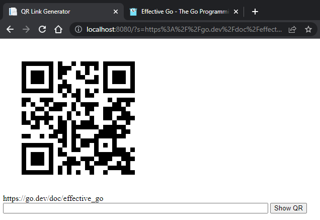

# Mini-project: HTTP Server
> The http server example from [Effective Go](https://go.dev/doc/effective_go)

This program implements a simple HTTP server that presents an input textfield in which you can type a URL (or text). The displayed page, will send a request to http://chart.apis.google.com to generate a QR code that encodes the given URL (or text).

The example makes use of the `html/template` package to generate the page.

