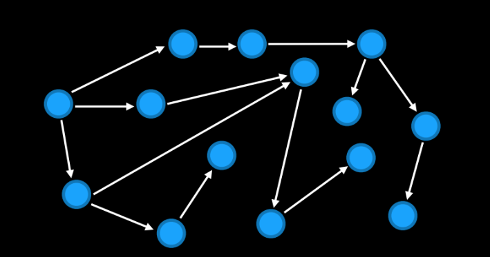
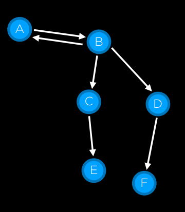
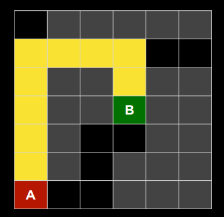

# Maze Solver using stacks
> solving a Maze using a stack

## Relevant AI concepts

This project will implement the solution using AI. In order to understand the solution, the following concepts will be needed:

Solving a maze is considered a classic AI search problem in which you try to find a solution to a problem. Examples of search problems include a navigator app that finds the best route from your origin to the destination, or like playing a game and figuring out the next move.

## Search

### A few basic concepts

Search problems involve an agent that is given an initial state and a goal state, and it returns a solution of how to get from the former to the latter.

> **Definition: agent**<br><br>An **agent** is an entity that perceives its environment and acts upon that environment.

When solving the solution to a maze, the agent is the AI program, or the person trying to solve the maze.

> **Definition: state**<br><br>A configuration of the agent and its environment.

In the maze problem, the state is the position that the AI/person (i.e., the agent) is evaluating at some point in time.

> **Definition: initial state**<br><br>The state in which the agent begins.

In the maze problem, the initial state is the start position of the maze.

> **Definition: actions**<br><br>Choices that can be made in a state. More formally, it can be defines as a function `Actions(s)` that returns the set of actions that can be executed in state `s`.

In the maze solving problem, if the current state is not surrounded by walls there are 4 possible actions:
+ move up
+ move right
+ move down
+ move left

> **Definition: transition model**<br><br>A description of what state results from performing any applicable action in any state. As a function, it can be defines as `Result(s, a)` which returns the state resulting from performing action `a` in state `s`.

> **Definition: state space**<br><br>The set of all states reachable from the initial state by any sequence of actions.<br>This is typically represented as a graph, where the nodes are the states, and the arrows represent the actions that transition from from some particular state to another.



> **Definition: goal test**<br><br>A way to determine whether a given state is a goal state.

In the maze problem, the goal test is checking that the current state matches the exit of the maze.

> **Definition: path cost**<br><br>A numerical cost associated with a given path.

The path cost is useful for problems with multiple ways of reaching the goal (e.g., driving directions). You will want to use AI to find the solution with the lest cost. This is typically solved by tagging the arrows in the graph with some number indicating the cost of that action or transition.

In many cases, the cost of the action will be 1, so the problem for the AI program is to find the set of actions with a minimum number of transitions.

> **Definition: solution**<br><br>A sequence of actions that lead from the initial state to a goal state.

> **Definition: optimal solution**<br><br>A solution that has the lowest path cost among all solutions.

### Characteristics of a search problem

Search problems are characterized by:
+ **initial state**: the place where we begin the search.
+ **actions**: the set of actions that we can take on any given state.
+ **transition model**: some way of defining what happens when we are in one state and take an action that lead us to another state.
+ **goal test**: some way of checking if a given state is the end state so that the search is over.
+ **path cost function**: a way that tells us how expensive the solution is in terms of time, money, or any other resource relevant in the search problem.

### Encoding the information about the search problem

In a search process, data is often stored in a **node**, a data structure that defined as:

> **Definition: node**<br><br>A data structure that keeps track of <ul><li>a state</li><li>its parent node, through which the current node is generated</li><li>the action that was applied to the state of the parent to get to the current node</li><li>the path cost from the initial state to this node</li></ul>

Nodes are data structures, and therefore, they don't search, they just hold information. To actually search, we need the **frontier**, the mechanism that manages the nodes.

> **Definition: frontier**<br><br>A data structure that keeps track of all the available actions from a given state that haven't been explored before.

The frontier represents all of the states that we could explore next, but that we haven't explored or visited.

### Approach

With all the definitions in place, we can start thinking about the algorithm that would lead us to solve the problem, in completely generic terms:

1. Start with a frontier that contains the initial state.
2. Repeat:
  1. If the frontier is empty, then there is no solution.
  2. Remove a node from the frontier. This will be the node that will be considered next in our search for a solution to the problem at hand.
    1. If the removed node contains the goal state, return the solution &mdash; we're done!
    2. Otherwise, expand the node. That is, find all the neighbors of that node, and add those to the frontier so that they can be subsequently explored.

As described above, the algorithm can lead to an infinite loop if it happens that there is a transition from A -> B, and from B -> A.



For example, in the classic [15 puzzle](https://en.wikipedia.org/wiki/15_puzzle) we can slide tile to the right and then slide again to the left.

A simple way to solve it is to keep track in another data structure of the states we've already explored.

Therefore, our revised generic algorithm for a search problem will be.

1. Start with a frontier that contains the initial state.

2. Initialize the explored set as an empty set. The explored set will keep track of the states we have already explored. Note that it won't hold the nodes, but the states themselves.

3. Repeat:
  1. If the frontier is empty, then there is no solution.
  2. Remove a node from the frontier. This will be the node that will be considered next in our search for a solution to the problem at hand.
    1. If the node removed contains the goal state, build the solution (that is, reconstruct the path from the initial state to the goal), return it, and we're done!
    2. Otherwise:
      1. Add the node to the explored set.
      2. Expand the node (i.e., find all the neighbors of the current node by examining the available actions from the current node), and add those resulting nodes to the frontier if:
        1. They are not already in the frontier.
        2. They are not already in the explored set.

### Search Strategies

The removal of a node from the frontier should be dictated by a rule and not performed arbitrarily.

There are two possible strategies:
+ A Stack based, last-in, first-out approach which will result in a depth-first search.
+ A Queue based, first-in, first-out approach will will result in a breadth-first search.

> **Definition: DFS (depth-first search algorithm)**<br><br>A search algorithm that expands the deepest node in the frontier.

> **Definition: BFS (breadth-first search algorithm)**<br><br>A search algorithm that always expands the shallowest node in the frontier.

There are some tradeoffs between **DFS** and **BFS**.

The *DFS* exhaust each and every path to the end to see if it leads to a solution. As a result, this one might take more time to get to it, as it chooses a path, and sticks to it.

| NOTE: |
| :---- |
| As long a we're dealing with a finite state space (e.g., finding the solution in a finite maze), DFS will always find a solution. |

DFS however, will not necessarily return the optimal solution. It can provide a *sub-optimal* solution, when there is a better solution to the problem.




Conversely, *BFS* explores all possible solutions from a given point, which might lead to a solution that takes up a lot of memory and resources to find the solution, but will find the solution faster, and will return the optimal solution.

| NOTE: |
| :---- |
| *BFS* will provide the optimal solution, although it might use more memory than *DFS*, because it might need to explore more states than *DFS*. |

## v0: initial version

We follow the algorithm to the letter and use the stacks in two particular places:
+ to reverse an array of strings (the solutions)
+ to implement the frontier (the data structure that keeps the nodes you can visit from the current one that hasn't been explored before).

## v1: refactoring, cleaning, and polishing

- [X] Split into files
- [-] Unit testing
- [-] Additional types for the maze as a matrix
- [X] Does it work for non-square mazes? What are the requirements
- [ ] Read from file

## v2: using the generics

In this version we use the generic version of the stack. We also use the existing version of the generic stack rather than copying it within the project, using the procedure explained below:

1. Find the path to the arraystack module:

    ```bash
    $ cat ../../02_stack-arraystack/arraystack-v0/go.mod
    module example.com/arraystack
    ```

2. Edit our current module to add the dependency to this module:

    ```bash
    go mod edit \
     --replace \
     example.com/arraystack=../../02_stack-arraystack/arraystack-v0/
    ```

3. Now we need to `get` the module:

    ```bash
    go get example.com/arraystack
    ```


